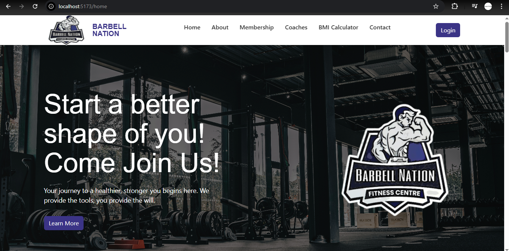
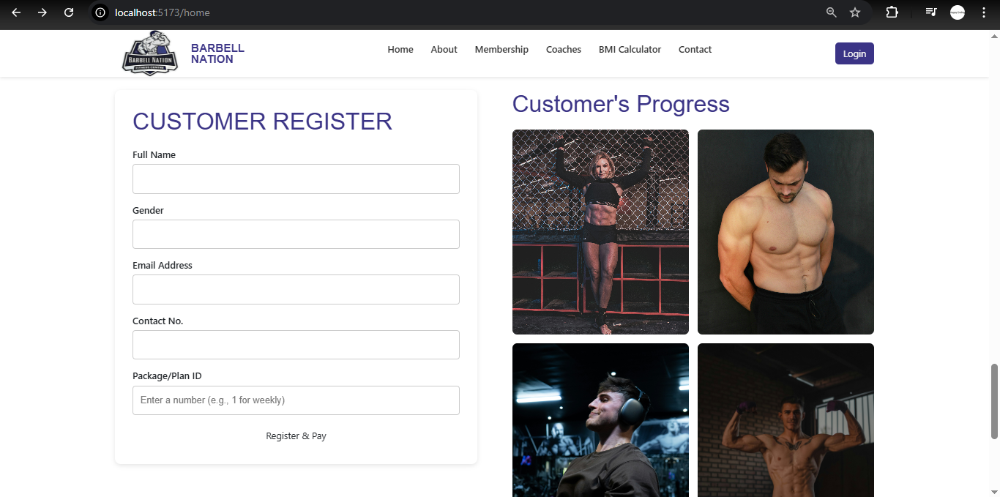
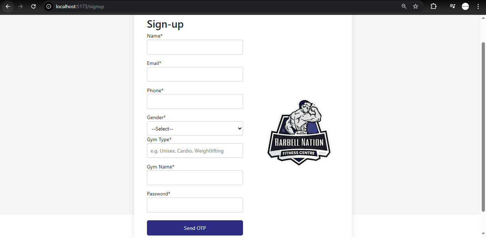
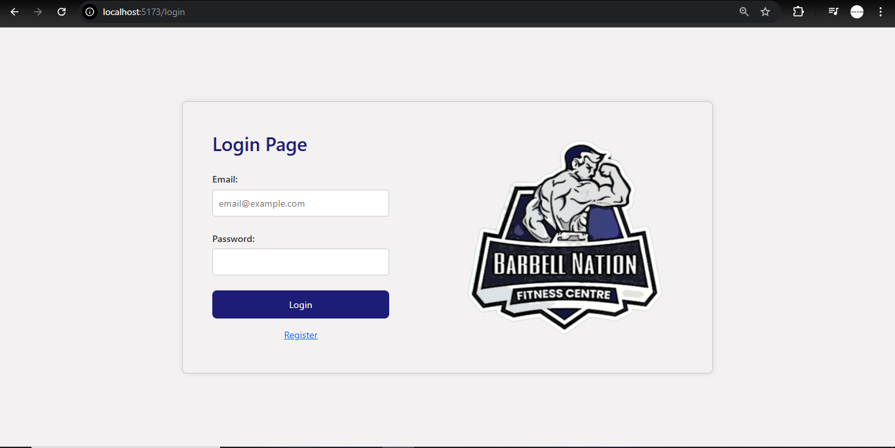
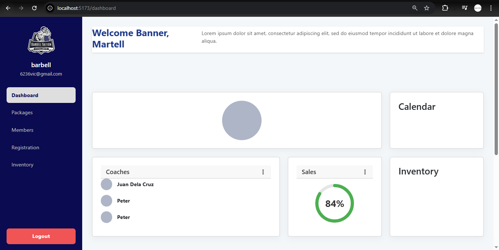
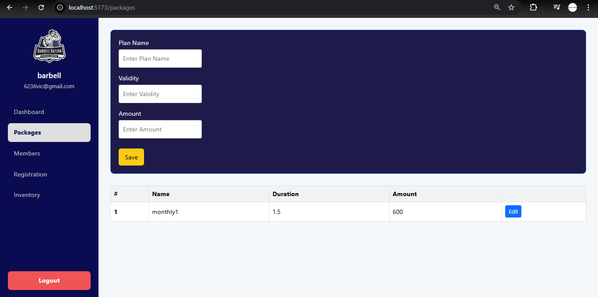
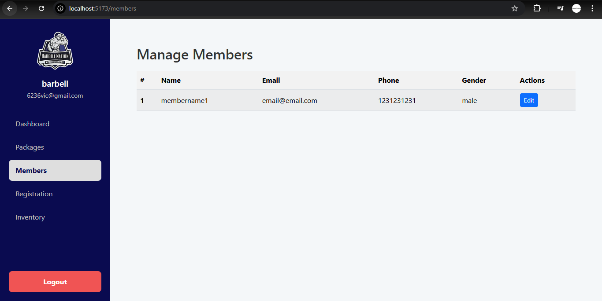
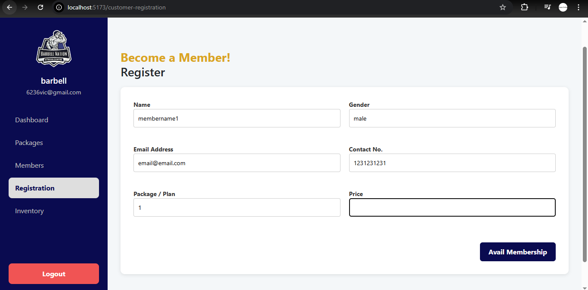
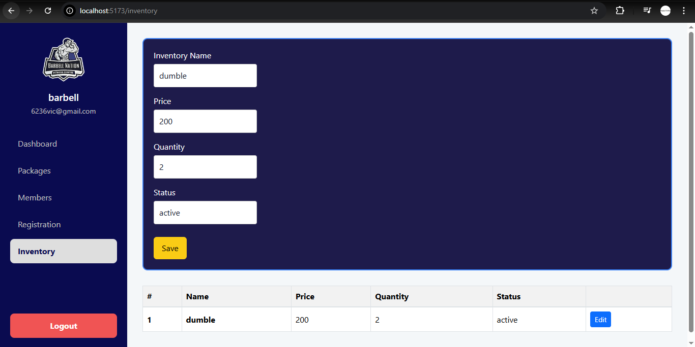

## [Barbell Nation Backend Repository Link](https://github.com/wevak/barbell-nation)

# Barbell Nation - A Gym Management System

BarbellNation is a custom solution for gym owners built using modern technologies such as React for Frontend and SpringBoot for Backend apis and MySQL for database where owner can manage multiple required operations and get their job easy to handle major of the gym's activities.

# 🚀 Deployed
## [Barbell Nation Frontend Deployment Link](https://barbell-nation-frontend.onrender.com)
## [Barbell Nation Backend Deployment Link](https://barbell-nation-deployment-latest.onrender.com)
- **Frontend & Backend** deployed on [Render.com](https://render.com/)
- **Database** deployed on [Neon Tech](https://neon.com/)
- **Note -** Server remains inactive, to wake up it takes 50-60 seconds for first query

## 🚀 Features

### For Gym Owners
- Register and verify account via OTP
- Manage packages/ membership plans
- Manage customers/ gym members
- Handle Inventory
- Manage Payments

## 🛠️ Technology Stack

### Frontend
- **React 19.1.0** - React UI Library
- **Redux** - State Management Library
- **React Router** - Navigation
- **Axios** - HTTP client
- **Bootstrap 5.3.7** - UI components

### Backend
- **Spring Boot** - Main framework
- **Spring Security** - Authentication & Authorization
- **Spring Data JPA** - Database operations
- **MySQL** - Database
- **JWT** - Token-based authorization
- **Spring Boot Stater Mail** - Email notifications
- **Maven** - Dependency management

# 🚀 Screenshots

    
    
    
    
    
    
    
    
    

